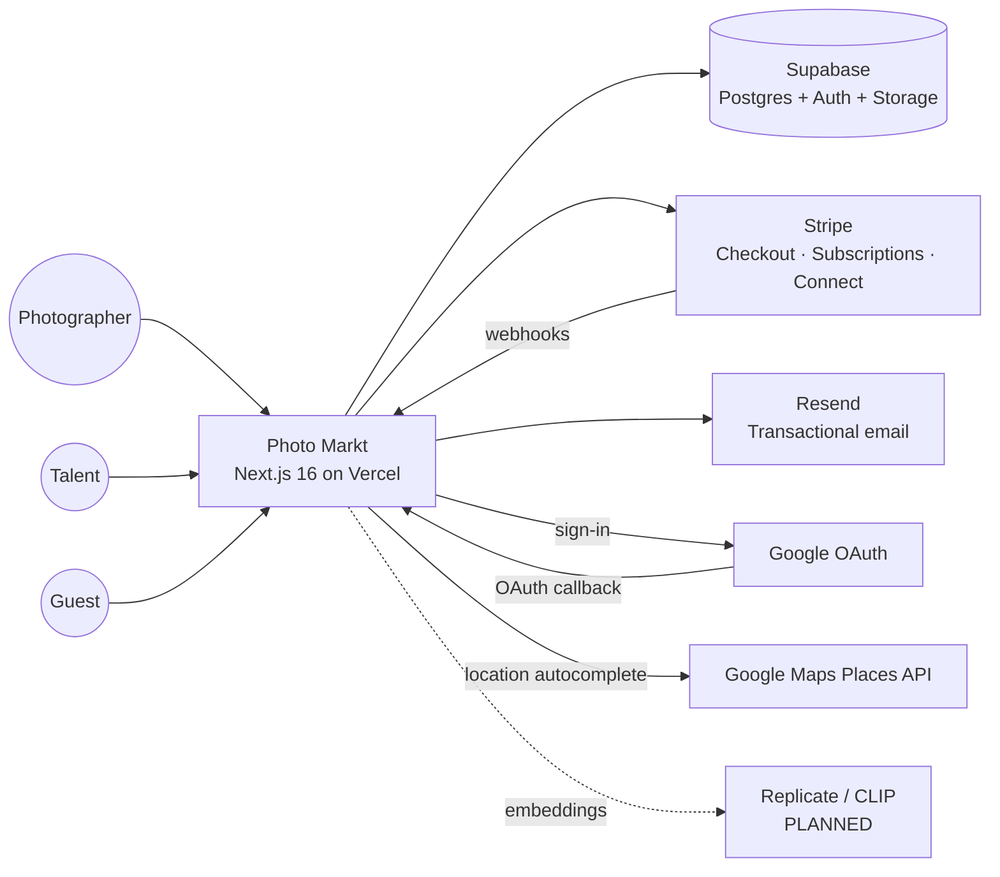
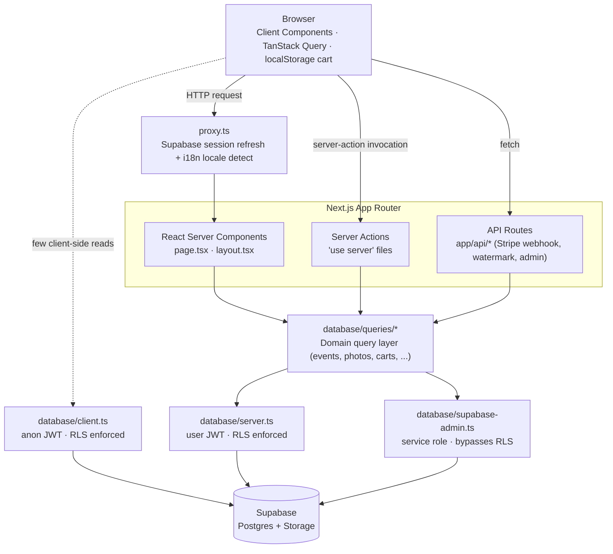
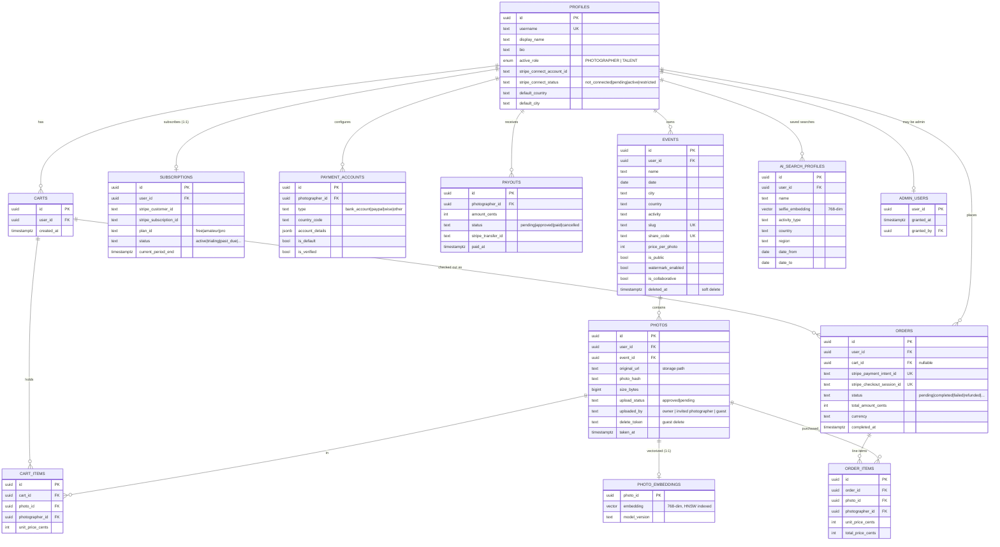
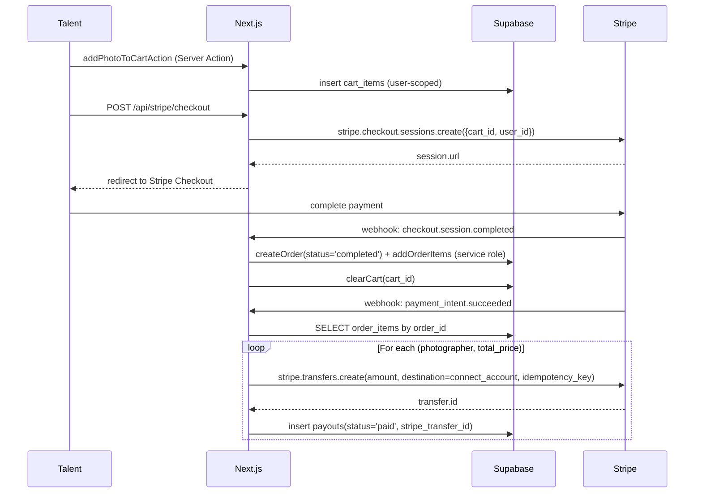
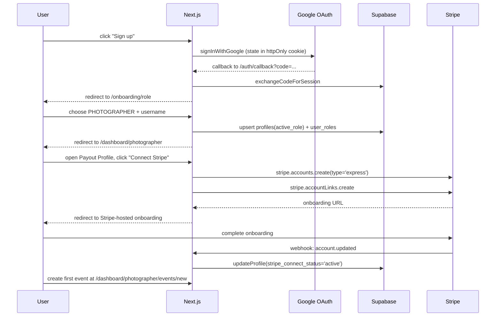
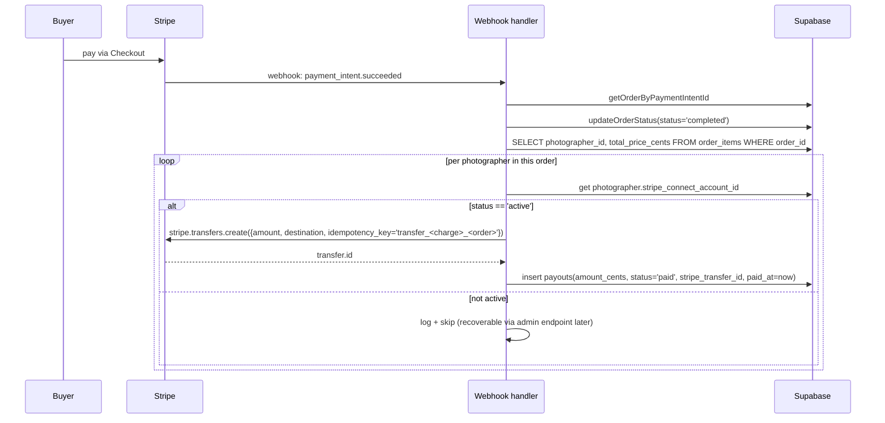
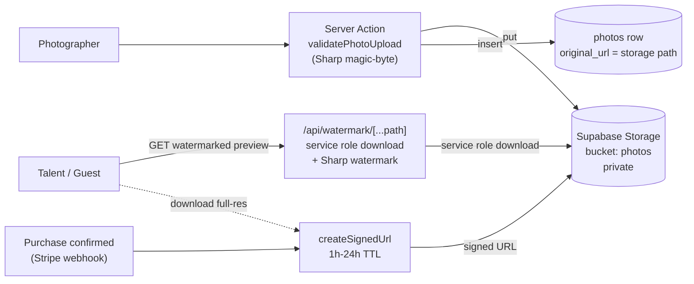
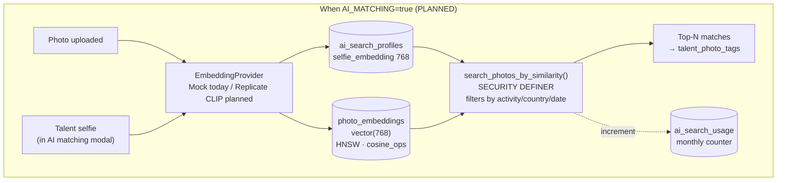

# Photo Markt — Architecture

Living architecture reference. Each section pairs a Mermaid diagram with a short
prose intro. Anything not yet implemented is explicitly marked **PLANNED** or
**DISABLED**.

Source of truth: actual migrations in `supabase/migrations/`, query layer in
`database/queries/`, routes in `app/[lang]/`, feature flags in
`lib/feature-flags.ts`. CLAUDE.md is supplementary; this document corrects it
where the code disagrees (e.g. "weekly payout cron" is aspirational — payouts
fire per-order on the Stripe webhook).

---

## 1. System context

Three user types interact with one Next.js app, which fans out to a handful of
external systems. Stripe and Supabase carry the load; the rest are
single-purpose integrations. The AI provider edge is dotted because it is
**PLANNED** — no production traffic flows there today.

---

## 2. Application architecture

Inside the app, four layers serve traffic: the browser, Next.js middleware,
the App Router (RSC + Client Components + Server Actions + API routes), and
the domain query layer. The query layer is the only place that talks to
Supabase — every other layer routes through it. Three distinct Supabase
client constructors enforce trust boundaries: anon (client-side, RLS),
authenticated (server-side, RLS), service role (admin-only, bypasses RLS).

Conventions enforced by this layout (see `CLAUDE.md`):

- **All mutations go through Server Actions**, not API routes. API routes are
  reserved for things that must be addressable HTTP endpoints (Stripe
  webhook, watermark CDN-style URL, admin endpoints).
- **Service role is used only when RLS would block a legitimate operation**
  (Stripe webhook writes, admin endpoints, watermark API, embedding writes).
  Every other path uses the user-scoped client so RLS catches mistakes.

---

## 3. Database schema (ER diagram)

The schema separates clearly into three concerns: identity (`profiles`,
`admin_users`, `subscriptions`), commerce (`carts → orders → payouts`), and
AI (`ai_search_profiles`, `photo_embeddings`). All `*_id` FKs to "users" are
to Supabase's built-in `auth.users` table (shown collapsed onto `profiles`
since `profiles.id` is a 1:1 FK to it). Auxiliary tables like
`talent_photo_tags`, `rate_limit_buckets`, `download_tokens`, `guest_orders`,
`event_photographers`, `time_sync_tokens`, `user_roles`, `feedback`, and
`pending_guest_checkouts` exist in the migrations but are omitted here to
keep the diagram readable — they're described in prose below.

**Auxiliary tables not pictured:**

- `talent_photo_tags` — talent users tagged on photos (photographer side for
  in-app tagging; talent side for "my photos" view). Composite-unique on
  `(photo_id, talent_user_id)`.
- `rate_limit_buckets` — fixed-window counter table backing `lib/rate-limit.ts`.
  Composite PK `(bucket_key, window_start)`. Service-role-only access.
- `ai_search_usage` — monthly per-user search counter; unique on
  `(user_id, period_year, period_month)`. Drives subscription-tier rate
  limits.
- `download_tokens` — opaque tokens minted on purchase that let guests
  download their photos via `/[lang]/download/[token]` without auth.
- `guest_orders` / `guest_order_items` / `pending_guest_checkouts` — mirror
  of the authenticated order flow for unauthenticated buyers.
- `event_photographers` — invitations to additional photographers for
  collaborative "organizer" events.
- `time_sync_tokens` — backs the camera-time-sync feature.
- `user_roles` / `user_role_memberships` — set of roles a user may switch
  between (vs `profiles.active_role` which is the *currently selected* role).
- `feedback` — user-submitted product feedback.

**Known schema-level findings** (see `docs/AI_MATCHING_AUDIT.md`):

- `photo_embeddings` INSERT/UPDATE policies are `using (true) with check
  (true)` — same defense-in-depth gap that was closed on `orders`/`payouts`.
  Authenticated users can write arbitrary embeddings via PostgREST.
- `ai_search_usage` has the same permissive UPDATE/INSERT/DELETE policy,
  and its `SECURITY DEFINER` RPCs (`increment_ai_search_usage`,
  `get_ai_search_usage_count`) never had EXECUTE revoked from anon /
  authenticated — they can be called directly by any user via PostgREST.

---

## 4. Key user flows

### 4.1 Photo purchase (authenticated talent)

The cart lives in Postgres for authenticated users. Checkout creates a Stripe
Checkout Session; the order is **only** written to the DB after Stripe
confirms via webhook, so abandoned checkouts produce no order rows. The
`checkout.session.completed` event writes the order and clears the cart; the
subsequent `payment_intent.succeeded` flips the status to `completed` *and*
creates the per-photographer Connect transfers in the same handler.

### 4.2 Photographer onboarding

Google is the only auth provider; a fresh user lands at `/onboarding/role`,
chooses PHOTOGRAPHER, picks a username, and is dropped on the dashboard. The
Stripe Connect Express onboarding is a separate step gated behind
"connect your payout account" — events can be created before this, but
checkout for that photographer's photos is blocked until `account.updated`
flips `stripe_connect_status` to `active`.

### 4.3 Photographer payout (via Stripe Connect transfer)

**Correction to CLAUDE.md:** there is no weekly payout cron. Transfers fire
**synchronously** with `payment_intent.succeeded` in the Stripe webhook,
one per (order_item, photographer) pair. The `payouts` table is the
historical record. A separate manual workflow exists where photographers
can request payouts and admins approve them via `/api/admin/payouts/[id]`,
but that path is admin-driven, not scheduled.

### 4.4 Guest cart merge on login

Guest carts live in `localStorage` under `picdemi_guest_cart`. On `SIGNED_IN`,
the client-side `GuestCartMerge` component calls a Server Action that
re-validates each photo against the DB (re-fetching the current price — the
client cannot tamper with prices) and adds it to the user's persistent cart.
Only on success does it clear the localStorage entry.

---

## 5. Photo upload + serving flow

Photographers upload directly to Supabase Storage (private bucket
`photos`). On the way in, `lib/photo-upload.ts:validatePhotoUpload` reads
magic bytes via Sharp and rejects anything that isn't a known image format;
the storage extension and content-type are derived from the *detected*
format, never from `file.name` or `file.type`. The originals are
payment-gated: previews are served watermarked through `/api/watermark`
(service role + tile overlay via Sharp), and full-resolution access only
happens through short-lived signed URLs after a purchase is confirmed.

Fail-closed behavior: the watermark API serves a generic placeholder JPEG
on any internal failure rather than falling back to the un-watermarked
source (see `app/api/watermark/[...path]/route.ts`).

---

## 6. AI matching architecture — **PLANNED · DISABLED**

The AI face-recognition feature has database scaffolding (HNSW-indexed
vectors, RPC for similarity search) and a complete UI behind the
`AI_MATCHING` feature flag, but **production traffic is disabled**. The
only embedding provider currently wired is a deterministic mock that does
not produce real similarity. A `feature/ai-matching-rewrite` branch added a
Replicate CLIP provider and a hybrid (perceptual hash + color signature +
embedding) approach but was never merged. See `docs/AI_MATCHING_AUDIT.md`
for a detailed inventory.

Status snapshot:

| Concern | State |
|---|---|
| Feature flag | `AI_MATCHING: false` in `lib/feature-flags.ts` |
| UI | Built (button + 5-step modal + results); renders "Coming soon" |
| DB schema | Deployed (vector(768), HNSW, RPC) — partially ahead of TS code |
| Embedding provider | Mock-only on `main`; Replicate CLIP exists on stale rewrite branch |
| Similarity search | `findSimilarPhotos` in `main` does app-layer cosine over a 1000-row prefetch (does not call the RPC, ignores HNSW); rewrite branch fixes this |
| Server actions | Wired and callable; flag check only enforced in UI |
| Rate limits | Tier quotas defined in `lib/ai/rate-limits.ts` (3 / 20 / unlimited per month) |

---

## 7. Tech stack summary

| Tech | Version | Role |
|---|---|---|
| **Next.js** | 16 | App Router, Server Components, Server Actions, API routes |
| **React** | 19 | UI framework |
| **TypeScript** | 5.9 | Type system (strict, no `any` allowed) |
| **Supabase** | `@supabase/ssr` 0.8, `supabase-js` 2.105 | Postgres + Auth (Google OAuth) + Storage + Realtime |
| **Postgres + pgvector** | 17 / 0.7 | Row-level security on every table; HNSW indexes for AI |
| **Stripe** | 20.4 | Checkout Sessions, Subscriptions, Connect Express transfers |
| **Resend** | 6.x | Transactional emails (purchase receipts, guest order delivery) |
| **Google OAuth** | — | Only auth provider |
| **Google Maps Places** | — | Location autocomplete in event create/edit forms only |
| **Replicate** | — | **PLANNED** CLIP embeddings (`andreasjansson/clip-features`, 768-dim) |
| **Sharp** | 0.34 | Server-side watermarking + magic-byte image validation |
| **Tailwind CSS** | v4 | Styling (CSS-first config in `app/globals.css`) |
| **shadcn/ui** | New York style + Radix primitives | Component library — do not introduce alternatives |
| **TanStack React Query** | 5 | Client-side data fetching/cache (cart count, AI search availability) |
| **TanStack React Form** | 1.x | Form state |
| **Zod** | 4 | Schema validation (forms + env via T3 Env) |
| **T3 Env** | 0.13 | Type-safe env vars in `env.mjs` |
| **Biome** | 2.3 | Linting + formatting (replaces ESLint + Prettier) |
| **tsx** | 4 | Test runner via `node:test` (`pnpm test`) |
| **pnpm** | — | Package manager + workspace lockfile |
| **Vercel** | — | Hosting (no native cron — payouts fire via Stripe webhook, not schedule) |

---

## Cross-references

- `CLAUDE.md` — engineering conventions, security utilities, code style.
- `docs/AI_MATCHING_AUDIT.md` — detailed reusability assessment of the AI
  feature scaffolding.
- `docs/AI_MATCHING.md` and `docs/AI_EMBEDDINGS_SETUP.md` — present only on
  the `feature/ai-matching-rewrite` branch.

**Discrepancies between CLAUDE.md and this document** (this document wins
for "what the code does today"):

1. CLAUDE.md says "Automatic weekly payouts via Stripe Connect ($25 minimum
   threshold)" — the codebase has no cron and no $25 threshold. Transfers
   are per-order, synchronous with `payment_intent.succeeded`.
2. CLAUDE.md says "AI Photo Search ... rate limiting" implies it is live —
   it is disabled.
3. CLAUDE.md lists `database/queries/sales.ts` and `earnings.ts` — those
   live as action files under `app/[lang]/dashboard/photographer/`, not as
   query modules.
