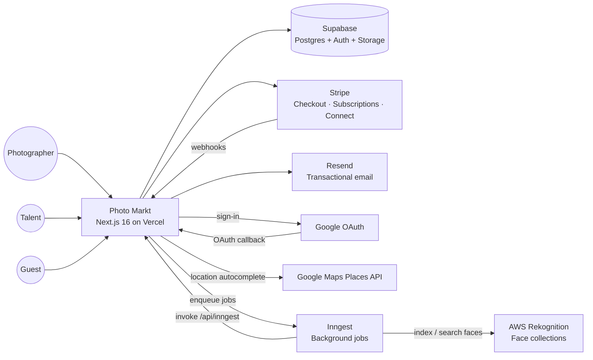
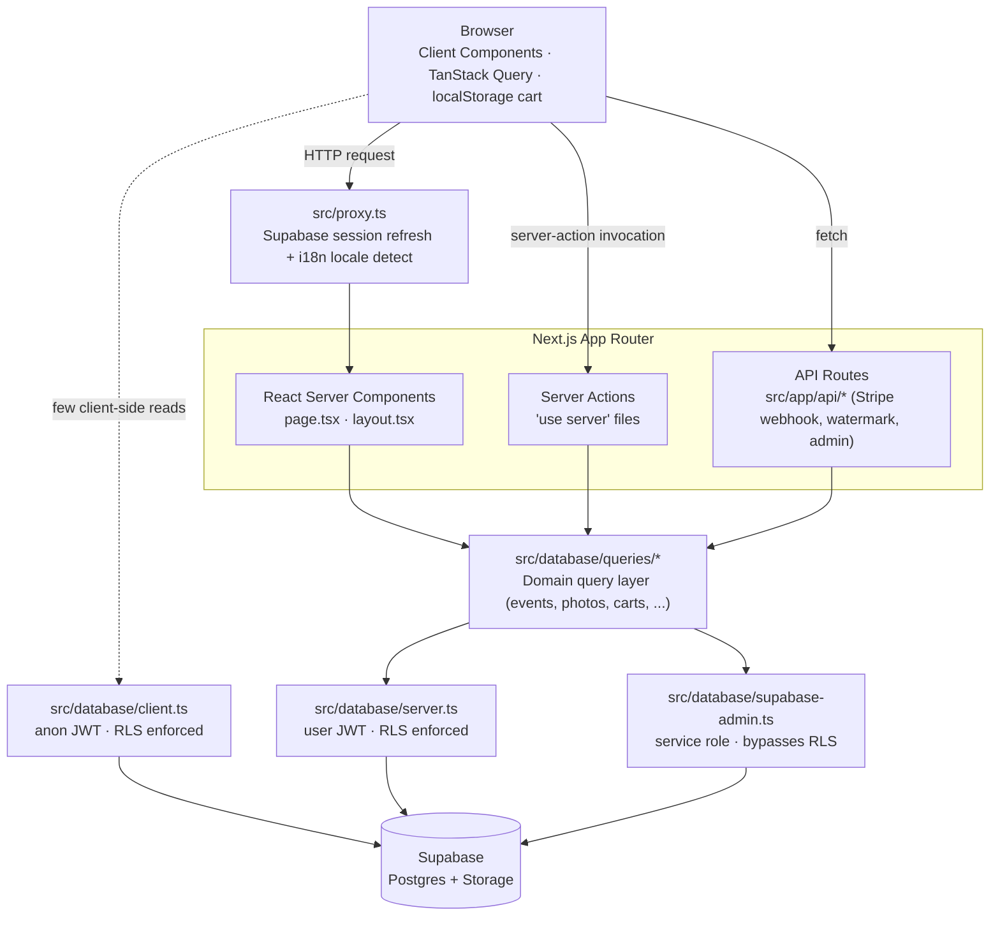
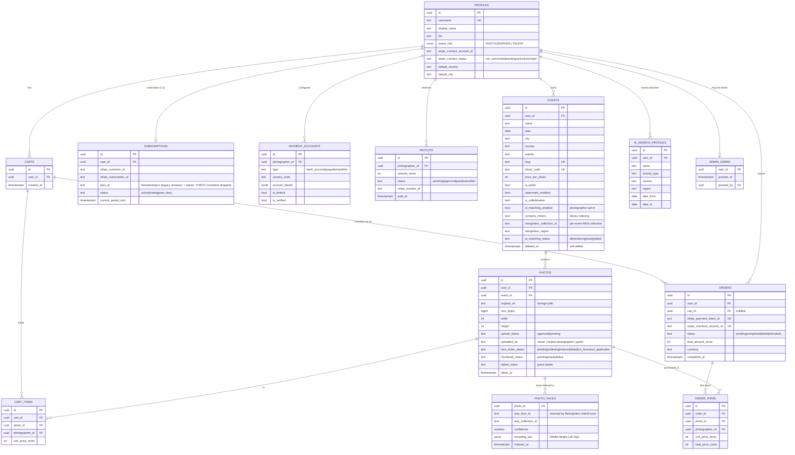
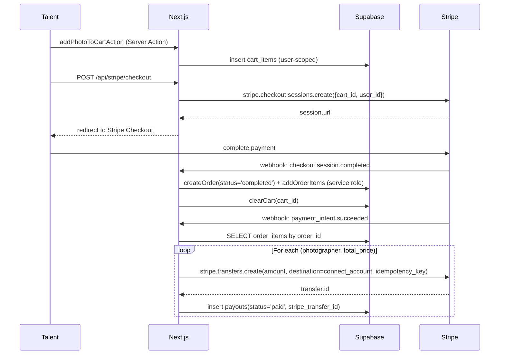
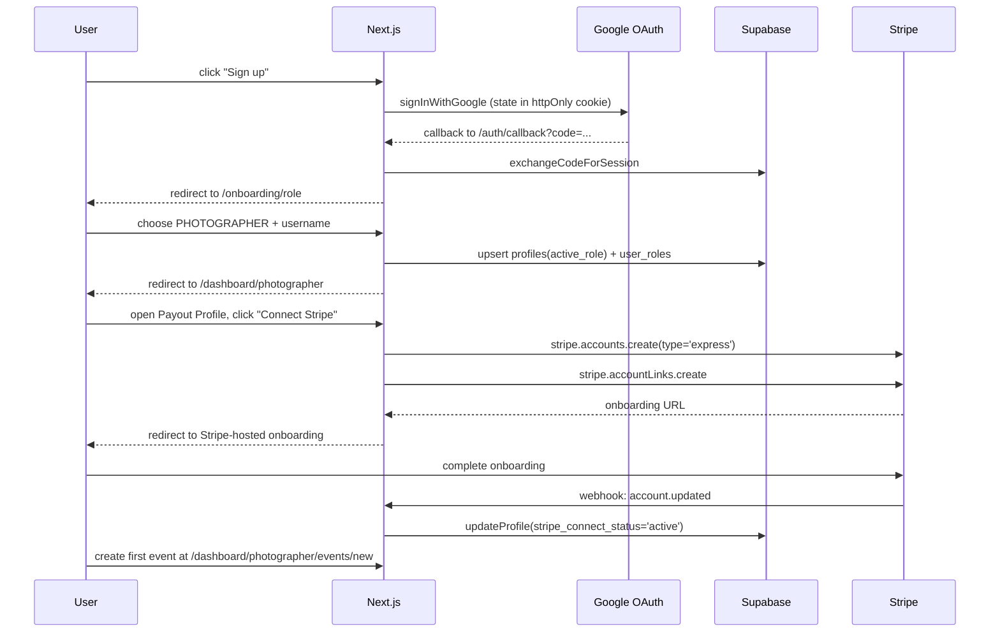
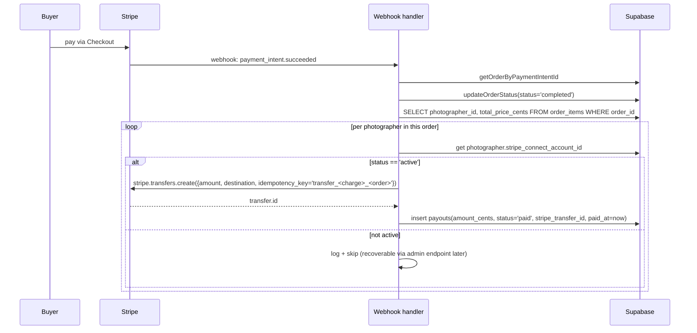
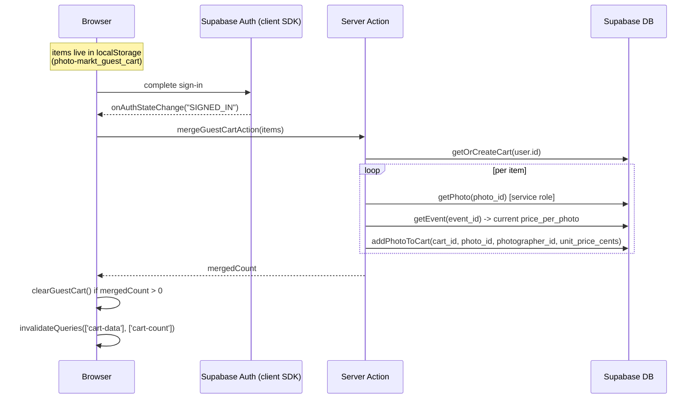
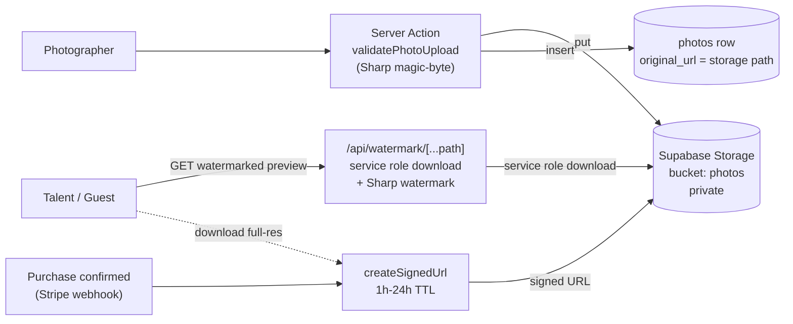
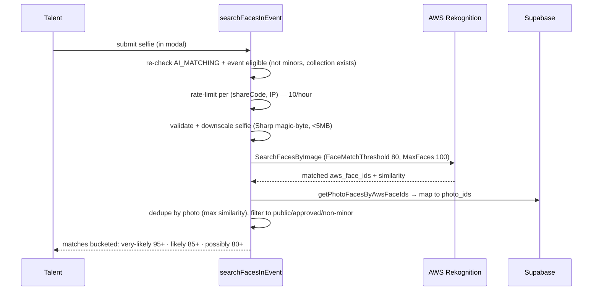

# Photo Markt — Architecture

Living architecture reference. Each section pairs a Mermaid diagram with a short
prose intro. Anything not yet implemented is explicitly marked **PLANNED** or
**DISABLED**.

Source of truth: actual migrations in `supabase/migrations/`, query layer in
`src/database/queries/`, routes in `src/app/[lang]/`, feature flags in
`src/lib/feature-flags.ts`. CLAUDE.md is supplementary; where the two ever
disagree, the code (and therefore this document) wins. One detail worth
calling out: payouts fire **per-order on the Stripe webhook**, not on a cron.

---

## 1. System context

Three user types interact with one Next.js app, which fans out to a handful of
external systems. Stripe and Supabase carry the load; the rest are
single-purpose integrations. AWS Rekognition (face indexing/search) and Inngest
(the background-job runner that drives it) are now live — AI photo matching
ships on `main`.



---

## 2. Application architecture

Inside the app, four layers serve traffic: the browser, Next.js middleware,
the App Router (RSC + Client Components + Server Actions + API routes), and
the domain query layer. The query layer is the only place that talks to
Supabase — every other layer routes through it. Three distinct Supabase
client constructors enforce trust boundaries: anon (client-side, RLS),
authenticated (server-side, RLS), service role (admin-only, bypasses RLS).



Conventions enforced by this layout (see `CLAUDE.md`):

- **All mutations go through Server Actions**, not API routes. API routes are
  reserved for things that must be addressable HTTP endpoints (Stripe
  webhook, watermark CDN-style URL, admin endpoints).
- **Service role is used only when RLS would block a legitimate operation**
  (Stripe webhook writes, admin endpoints, watermark API, Inngest face-index writes).
  Every other path uses the user-scoped client so RLS catches mistakes.

### 2.1 Database code layout — two deliberate layers

Everything database-related lives in **two** places, on purpose. They are not
one thing split by accident — they are two different layers with two different
owners, and merging them into one physical directory fights a hard convention
either way:

| Layer | Location | Owner | What lives here |
|-------|----------|-------|-----------------|
| **Infrastructure** | `supabase/` (repo root) | Supabase CLI | `config.toml`, `migrations/`, `seed.sql`, `.branches`, `.temp`, `snippets/` |
| **Application code** | `src/database/` | The app | `client.ts` / `server.ts` / `supabase-admin.ts` (the three clients) + `queries/` (the domain query layer) |

Why they stay separate:

- **`supabase/` must sit at the repo root.** The Supabase CLI (`supabase
  start/reset/db push`, migration diffing, branching) resolves `supabase/`
  relative to the project root. `--workdir` exists but is off-convention and
  breaks the default `pnpm db:*` scripts. Moving it buys nothing and breaks the
  migration flow.
- **`src/database/` must stay under `src/`.** T-019 (PR #76) moved *all*
  application source under `src/`. Pulling the DB code back out to the root to
  sit next to `supabase/` would re-break that convention.

So the split is intentional: **infra vs app code**, not "misplaced files". Each
directory carries a `README.md` pointing at the other so the two halves are
discoverable from either side. Editors looking for "the database stuff" should
start at whichever layer matches the task — schema/migrations → `supabase/`;
reads/writes from the app → `src/database/queries/`.

---

## 3. Database schema (ER diagram)

The schema separates clearly into three concerns: identity (`profiles`,
`admin_users`, `subscriptions`), commerce (`carts → orders → payouts`), and
AI face matching (`ai_search_profiles`, `photo_faces`). All `*_id` FKs to "users" are
to Supabase's built-in `auth.users` table (shown collapsed onto `profiles`
since `profiles.id` is a 1:1 FK to it). Auxiliary tables like
`talent_photo_tags`, `rate_limit_buckets`, `download_tokens`, `guest_orders`,
`event_photographers`, `time_sync_tokens`, `user_roles`, `feedback`, and
`pending_guest_checkouts` exist in the migrations but are omitted here to
keep the diagram readable — they're described in prose below.



> The face embeddings themselves live inside AWS Rekognition collections —
> Postgres only stores the returned `aws_face_id` per face. The old
> `photo_embeddings` / `selfie_embedding` pgvector schema was dropped in
> migration `20260518000000_drop_legacy_ai_schema.sql`.

**Auxiliary tables not pictured:**

- `talent_photo_tags` — talent users tagged on photos (photographer side for
  in-app tagging; talent side for "my photos" view). Composite-unique on
  `(photo_id, talent_user_id)`.
- `rate_limit_buckets` — fixed-window counter table backing `src/lib/rate-limit.ts`.
  Composite PK `(bucket_key, window_start)`. Service-role-only access.
- `photo_faces` — one row per face AWS Rekognition indexes in a photo
  (`aws_face_id`, `aws_collection_id`, `confidence`, `bounding_box`). Unique on
  `(photo_id, aws_face_id)`. Talent selfie search maps Rekognition face IDs back
  to photos through this table (`src/database/queries/rekognition.ts`).
- `ai_search_usage` — monthly per-user search counter, unique on
  `(user_id, period_year, period_month)`. Part of the legacy AI schema and no
  longer queried from application code; the live per-search/monthly quotas are
  enforced via `src/lib/rate-limit.ts` + `src/lib/ai/rate-limits.ts`.
- `download_tokens` — opaque tokens minted on purchase that let guests
  download their photos via `/[lang]/download/[token]` without auth.
- `guest_orders` / `guest_order_items` / `pending_guest_checkouts` — mirror
  of the authenticated order flow for unauthenticated buyers.
- `event_photographers` — invitations to additional photographers for
  collaborative "organizer" events.
- `time_sync_tokens` — backs the camera-time-sync feature.
- `user_roles` / `user_role_memberships` — set of roles a user may switch
  between (vs `profiles.active_role` which is the *currently selected* role).
- `feedback` — user-submitted product feedback.

**Legacy AI schema (vestigial):** the original pgvector matching path —
`photo_embeddings`, `ai_search_profiles.selfie_embedding`,
`photos.photo_hash` / `color_signature`, and the
`search_photos_by_similarity()` RPC — was dropped in migration
`20260518000000_drop_legacy_ai_schema.sql` and is no longer referenced from
code. Any remnants that still physically exist (e.g. the `photo_embeddings`
table or `ai_search_usage` RPCs flagged in `docs/AI_MATCHING_AUDIT.md` for
permissive `using (true)` policies and un-revoked `SECURITY DEFINER` EXECUTE)
should be dropped or locked down — they are not part of the live Rekognition
flow.

---

## 4. Key user flows

### 4.1 Photo purchase (authenticated talent)

The cart lives in Postgres for authenticated users. Checkout creates a Stripe
Checkout Session; the order is **only** written to the DB after Stripe
confirms via webhook, so abandoned checkouts produce no order rows. The
`checkout.session.completed` event writes the order and clears the cart; the
subsequent `payment_intent.succeeded` flips the status to `completed` *and*
creates the per-photographer Connect transfers in the same handler.



### 4.2 Photographer onboarding

Google is the only auth provider; a fresh user lands at `/onboarding/role`,
chooses PHOTOGRAPHER, picks a username, and is dropped on the dashboard. The
Stripe Connect Express onboarding is a separate step gated behind
"connect your payout account" — events can be created before this, but
checkout for that photographer's photos is blocked until `account.updated`
flips `stripe_connect_status` to `active`.



### 4.3 Photographer payout (via Stripe Connect transfer)

**Correction to CLAUDE.md:** there is no weekly payout cron. Transfers fire
**synchronously** with `payment_intent.succeeded` in the Stripe webhook,
one per (order_item, photographer) pair. The `payouts` table is the
historical record. A separate manual workflow exists where photographers
can request payouts and admins approve them via `/api/admin/payouts/[id]`,
but that path is admin-driven, not scheduled.



**Connect API version — Accounts v1 (deliberate, T-164).** Our entire Connect
surface uses **Accounts v1**: `accounts.retrieve/create`, `accountLinks.create`,
`balance.retrieve` (`src/lib/stripe/connect.ts`) and the webhook's
`transfers.create`. Since the SDK bump to `stripe@22` (T-152), each v1 Accounts
call relays a server-sent notice — "We recommend building your integration using
Accounts v2" — via `process.emitWarning`. We stay on v1 **on purpose**: it is
fully supported with no sunset date, and migrating to Accounts v2 is a large,
payment-critical change (different account-creation/onboarding/retrieve/balance/
transfer shapes) with no functional benefit today. It would be its own ticket
with OpenSpec + `/code-review ultra`, not done ad hoc. The recommendation is
informational, so `src/lib/stripe/suppress-accounts-v2-warning.ts` filters that
one message out of process warnings (installed from `config.ts`); every other
warning still surfaces.

### 4.4 Guest cart merge on login

Guest carts live in `localStorage` under `photo-markt_guest_cart`. On `SIGNED_IN`,
the client-side `GuestCartMerge` component calls a Server Action that
re-validates each photo against the DB (re-fetching the current price — the
client cannot tamper with prices) and adds it to the user's persistent cart.
Only on success does it clear the localStorage entry.



---

## 5. Photo upload + serving flow

Photographers upload directly to Supabase Storage (private bucket
`photos`). On the way in, `src/lib/photo-upload.ts:validatePhotoUpload` reads
magic bytes via Sharp and rejects anything that isn't a known image format;
the storage extension and content-type are derived from the *detected*
format, never from `file.name` or `file.type`. The originals are
payment-gated: previews are served watermarked through `/api/watermark`
(service role + tile overlay via Sharp), and full-resolution access only
happens through short-lived signed URLs after a purchase is confirmed.



Fail-closed behavior: the watermark API serves a generic placeholder JPEG
on any internal failure rather than falling back to the un-watermarked
source (see `src/app/api/watermark/[...path]/route.ts`).

---

## 6. AI matching architecture — **ENABLED**

AI photo matching ships on `main` (`AI_MATCHING: true`). It is built on **AWS
Rekognition face collections** driven by **Inngest** background jobs — the
earlier pgvector/CLIP design was removed (see migration
`20260518000000_drop_legacy_ai_schema.sql`). The face embeddings live inside
AWS; Postgres only stores the `aws_face_id` each photo maps to. Selfies used
for search are **ephemeral** — sent to Rekognition per request and never
persisted.

Two things gate indexing per event: the photographer must opt in
(`events.ai_matching_enabled`) and the event must not be flagged
`contains_minors`. Each event gets its own Rekognition collection, named
`${REKOGNITION_COLLECTION_PREFIX}-${env}-event-${eventId}`
(`src/lib/aws/collection-naming.ts`).

**Indexing (photographer side).** A new photo emits a `photo.uploaded` Inngest
event, which two functions consume in parallel:

```mermaid
flowchart TB
  Upload["Photo uploaded<br/>(server action)"] -->|emit photo.uploaded| Inngest["Inngest"]

  Inngest --> Index["indexPhotoFaces<br/>src/lib/inngest/functions/index-photo-faces.ts"]
  Inngest --> Thumbs["generatePhotoThumbnails<br/>WebP 400px + 800px → Storage"]

  Index -->|download original| Storage[("Supabase Storage")]
  Index -->|IndexFaces (MaxFaces 10, QualityFilter AUTO)| Rek["AWS Rekognition<br/>per-event collection"]
  Index -->|insert rows| Faces[("photo_faces<br/>aws_face_id + bounding_box")]
  Index -->|set face_index_status| Photos[("photos")]
  Index -->|drain → ai_matching_status='ready'| Events[("events")]
```

Lifecycle events fan out to dedicated functions: enabling AI on an existing
event triggers `backfillEventIndexing` (`event.ai-matching-enabled` → create
collection, reset statuses, re-emit `photo.uploaded` per photo); disabling
triggers `disableEventIndexing` (delete collection + `photo_faces`); deleting an
event triggers `cleanupOnEventDelete` (hard-delete the AWS collection even
though the event is soft-deleted, to save cost). All functions are registered at
`src/app/api/inngest/route.ts`.

**Search (talent side).** `searchFacesInEvent`
(`src/app/[lang]/events/[shareCode]/actions.ts`, surfaced by
`src/components/event-gallery-with-face-search.tsx` → `FaceSearchModal`):



Every AWS / Sharp / Storage call in both flows is wrapped in `safeCall`
(`src/lib/safe-call.ts`), which strips the original error so image buffers can't
leak into Inngest's step-output record or a serverless error response.

Status snapshot:

| Concern | State |
|---|---|
| Feature flag | `AI_MATCHING: true` in `src/lib/feature-flags.ts` (re-checked server-side in `searchFacesInEvent`) |
| Provider | AWS Rekognition collections — `IndexFaces` / `SearchFacesByImage` / `CreateCollection` / `DeleteFaces` / `DeleteCollection` (`src/lib/aws/`) |
| Background runner | Inngest — `indexPhotoFaces`, `generatePhotoThumbnails`, `backfillEventIndexing`, `disableEventIndexing`, `cleanupOnEventDelete` + storage-cleanup jobs |
| DB footprint | `photo_faces` (face IDs), `events.rekognition_*` / `ai_matching_status`, `photos.face_index_status` / `thumbnail_status` |
| Selfie storage | None — ephemeral per search |
| Rate limits | Monthly quota by plan (free 3 / starter 20 / pro unlimited, `src/lib/ai/rate-limits.ts`) + per-`(shareCode, IP)` 10/hour |
| Compliance gate | `events.contains_minors` blocks indexing and search |

---

## 7. Tech stack summary

| Tech | Version | Role |
|---|---|---|
| **Next.js** | 16 | App Router, Server Components, Server Actions, API routes |
| **React** | 19 | UI framework |
| **TypeScript** | 5.9 | Type system (strict, no `any` allowed) |
| **Supabase** | `@supabase/ssr` 0.8, `supabase-js` 2.105 | Postgres + Auth (Google OAuth) + Storage + Realtime |
| **Postgres** | 17 | Row-level security on every table (pgvector left enabled but unused since the legacy AI schema was dropped) |
| **Stripe** | 20.4 | Checkout Sessions, Subscriptions, Connect Express transfers |
| **Resend** | 6.x | Transactional emails (purchase receipts, guest order delivery) |
| **Google OAuth** | — | Only auth provider |
| **Google Maps Places** | — | Location autocomplete in event create/edit forms only |
| **AWS Rekognition** | `@aws-sdk/client-rekognition` | Face indexing/search for AI photo matching (per-event collections) |
| **Inngest** | — | Background-job runner (face indexing, thumbnails, storage cleanup) served at `/api/inngest` |
| **Sharp** | 0.34 | Server-side watermarking, thumbnail generation + magic-byte image validation |
| **Tailwind CSS** | v4 | Styling (CSS-first config in `src/app/globals.css`) |
| **shadcn/ui** | New York style + Radix primitives | Component library — do not introduce alternatives |
| **TanStack React Query** | 5 | Client-side data fetching/cache (cart count, AI search availability) |
| **TanStack React Form** | 1.x | Form state |
| **Zod** | 4 | Schema validation (forms + env via T3 Env) |
| **T3 Env** | 0.13 | Type-safe env vars in `env.mjs` |
| **Biome** | 2.3 | Linting + formatting (replaces ESLint + Prettier) |
| **Vitest** | — | Test runner (`pnpm test`); integration tests run against local Supabase |
| **pnpm** | — | Package manager + workspace lockfile |
| **Vercel** | — | Hosting (no native cron — payouts fire via Stripe webhook, not schedule) |

---

## Cross-references

- `CLAUDE.md` — engineering conventions, security utilities, code style.
- `docs/deployment.md` — production go-live checklist: env vars, migrations,
  Stripe live-mode, Resend domain, security headers/CSP, post-deploy smoke test.
- `docs/AI_MATCHING_AUDIT.md` — detailed reusability assessment of the AI
  feature scaffolding.
- `docs/AI_MATCHING.md` and `docs/AI_EMBEDDINGS_SETUP.md` — present only on
  the `feature/ai-matching-rewrite` branch.

**Consistency with CLAUDE.md.** As of this revision the two documents agree on
the previously-flagged points: payouts are per-order on the Stripe webhook (no
cron, no minimum threshold), and AI photo matching is **enabled** (AWS
Rekognition + Inngest). If they ever drift again, the code — and this
document — wins for "what runs today."
